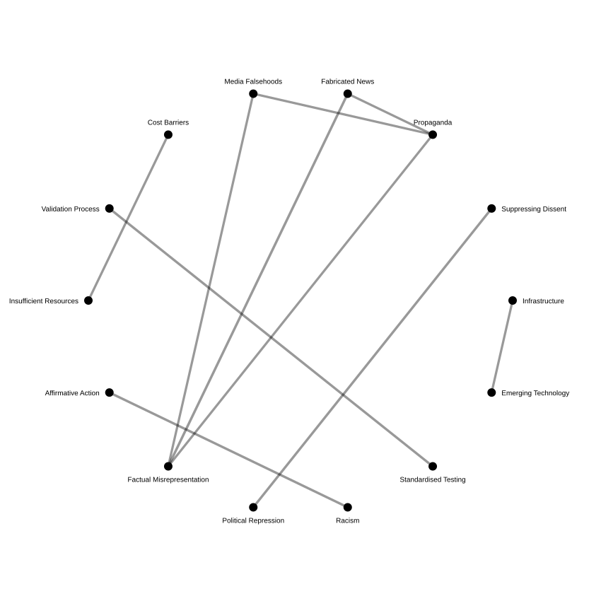

<!-- Google tag (gtag.js) -->

<h1 style="text-align: center;">

MA'AT: 

<b>M</b>ultilingual <b>A</b>rchive for <b>A</b>cademic <b>T</b>opology

 

<i>A computational observatory of global higher education discourse</i>

</h1>

---

## Abstract

MA'AT is a multilingual information system that observes how higher education is discussed across global media, policy documents, and institutional sources. It aggregates RSS feeds from diverse linguistic ecosystems and transforms them into a structured dataset using semantic filtering and language-agnostic embeddings.

The system aims to map recurring patterns in how universities, governance structures, and academic systems are evolving across the world.

---

## System Overview

MA'AT operates as a continuous ingestion pipeline:

- RSS feeds from global academic, policy, and journalistic sources  
- multilingual embedding model for semantic comparison  
- relevance filtering against a curated conceptual space  
- language detection and optional translation  
- deduplication and structured storage  

Each article is evaluated not by keywords, but by semantic proximity to higher education-related concepts.

---

## Dominant Themes



<table>
<tr>
<th>Category</th>
<th>Article Count</th>
<th>Lead Article</th>
</tr>


<tr>
<td>{{ topic.topic }}</td>
<td>{{ topic.count }}</td>
<td>

<a href="{{ topic.evidence.url }}" target="_blank" rel="noopener noreferrer">

{{ topic.evidence.headline }}

</a>

</td>
</tr>


</table>

---

## Strongest Topic Connections

---

## System Status


<ul>
<li>Total stored articles: {{ system.total_articles | default: "—" }}</li>
<li>Last run: {{ system.last_run | date: "%Y-%m-%d" | default: "—" }}</li>
</ul>

---

## Limitations

MA'AT depends on RSS availability and successful article extraction. Paywalled content, incomplete feeds, and extraction failures reduce coverage. Semantic filtering also introduces bias toward conceptually explicit texts, potentially underrepresenting implicit or emergent discourse.

---

## Future Directions

- longitudinal mapping of policy narratives  
- cross-country discourse comparison  
- institutional actor tracking  
- temporal evolution of semantic clusters  
- visualisation of global higher education “attention fields”

